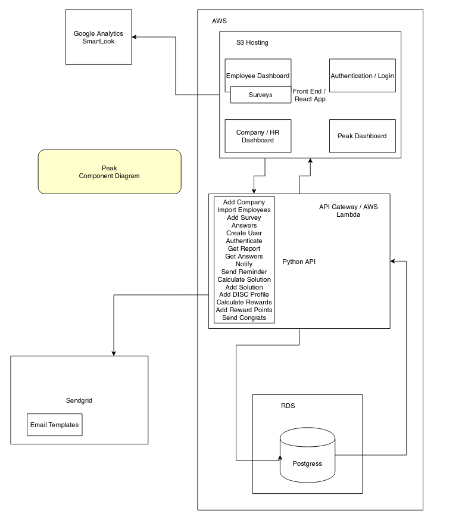
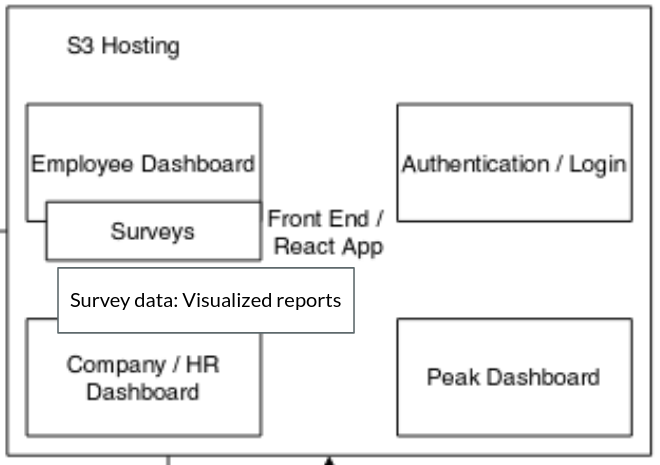
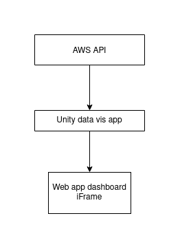

# Architecture Diagrams

## Existing Peak Mind structure

* Visualized data reports will be integrated into the already existing Peak Mind webapp using ReactJS.

## VR data visualization system

* AWS API: Biometric data will be received from Peak Mind's database.

* Unity data vis app: Our app will accept this data and transform it into VR modules.

* These visualizations will be sent through to the already-existing web app dashboard and displayed as an iFrame.