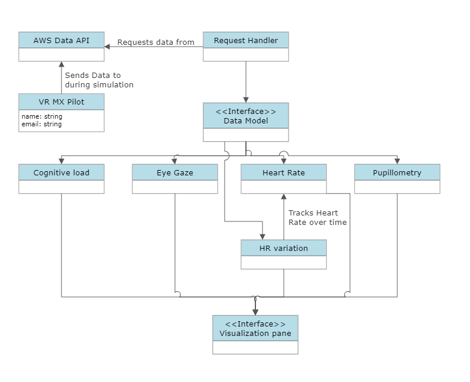
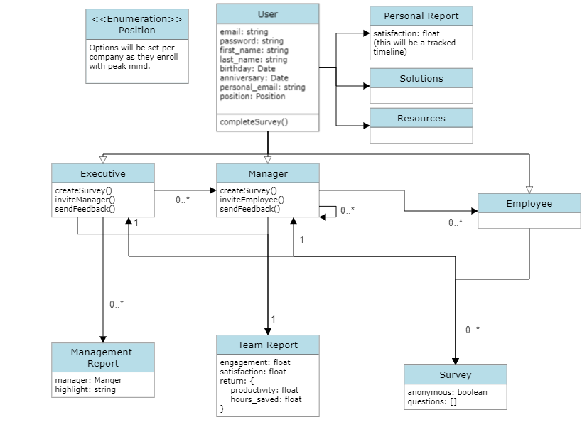

# VR data visualizations

 * AWS Data API
    - Created by clients and will be where we be requesting data from.
* VR MX Pilot
    - Representation of user sending data from the HP Omnicept vr headset.
* Request Handler
    - Class responsible for handling the HTTPS requests from the unity application to the AWS API.
* Data Model
    - Interface expected for data parsing which will include each set of data collected for a simulation including: Cognitive load, eye gaze, heart rate, pulse variation, and pupillometry. (Mostly handled through HP SDK).
* Visualization Pane
   - Responsible for the actual visual output of the data parsed from a specific data model .(implementation will vary depeding on data set).

# Peak Mind web app

* User
    - Will represent a member of a company enrolled with peak mind. This will also include the login information for the peak mind app.
* Personal Report
    - Will be a graph representing the levels of satisfaction through the system within a given time range.
* Solutions
    - A list of resources provided by Peak Mind intnded to help users with things such as stress.
* Resources
    - Additional resources similar to solutions provided from the user's company.
* Executive
    - Type of User that will have elevated access to data and additional functionality like creating surveys and monitoring managers/teams.
* Manager
    - Type of user will elevated access to data for their team.
* Employee
    - Low level user with the ability to see resources and solutions as well as answer surveys
* Survey
    - Questionare created by Executives and Managers meant to measure productivity and Employee well being.
* Team Report
    - Collection of data about teams including productivity and satisfaction.
* Management Report
    - only accessible by Executives and provides highlight information about managers like if a manager has a high level of negative survey results.