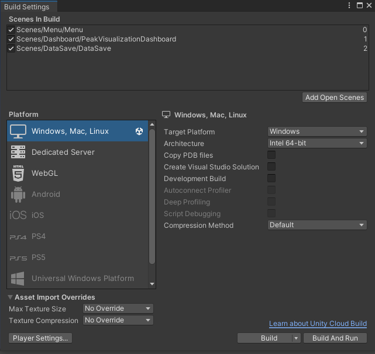

# Unity Application

1. From the Unity editor with the project open. Click **File** in the top left of the editor window then select **Build Settings...**
2. In the build setting window ensure that the `Scenes in build` table order is **Menu**, followed by **PeakVisualizationDashboard**, and finally **DataSave**.

3. Press the build button. This is will open a prompt to choose where the build will be saved to. Go into the **Build** folder of the Unity project (this folder may not exist if you haven't run any builds before). While inside the **Build** folder create a new folder with whatever name you find most useful.

4. Once the build is finished It will open the folder that contains all of the build products. The **PeakVisualization** application will be the main executable for the application. 

# Web Application

## Frontend

- To build the web application, open terminal at the project directory.

- Then, run `npm run build` to create a build folder within the main directory.

- Upload the build folder to a hosting service.

## Backend 

- The backend is ready to run in a web server by running the shell script in the `bin/` folder: `bin/run.sh`.

- In the environment you will have to set the environment variable `ENV` variable to `production`. Currently there is no production configuration so you will have to create an appropriate one in the `backend/api/config.py` file because it currently only has a configuration for development and testing.

- The api is setup to run on the popular Python webserver flavor `Gunicorn`. so if that is not your preference for production you'll have to create a diffent setup for the api.

- You can just take the code in the `backend` directory and run the setup shell script on a web server running Gunicorn or in a container and put on a cloud hosting service. To route traffic you will likely need some sort of load balancer to route http or https traffick to port 8080 (or the port you configured) on the web server.

- When running the backend application on a webserver for the first time you will need to create the list of admins for the Peak Mind on the webserver it self. A custom Flask cli script was added to the backend so that admins can be created by running `flask create-admin --username --password`. If you are running the backend in a container service you will need to create a script to create these users otherwise you can connect to the web server via ssh to run this command whenever an Admin needs to be added.