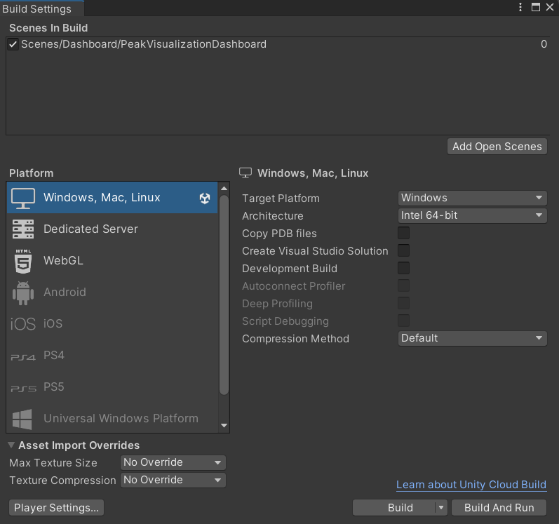
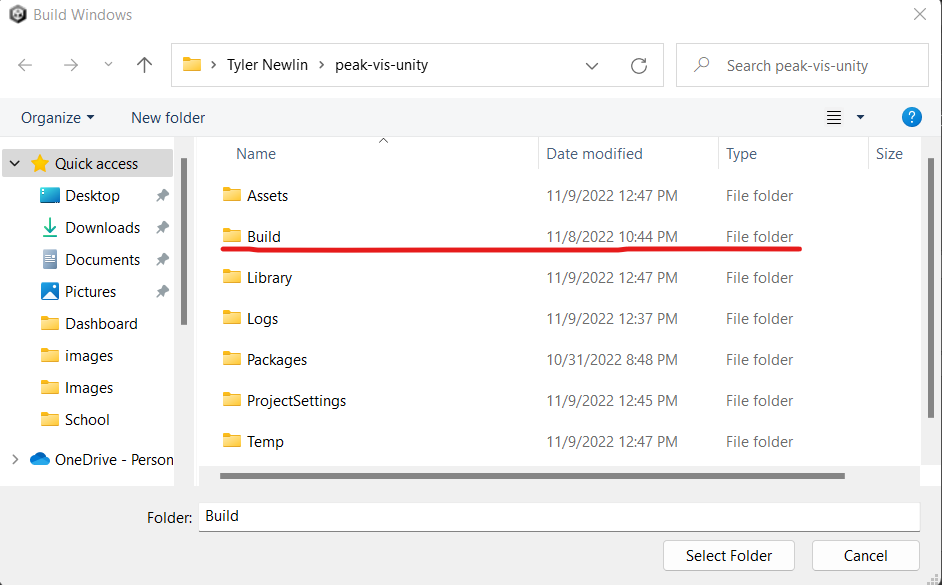
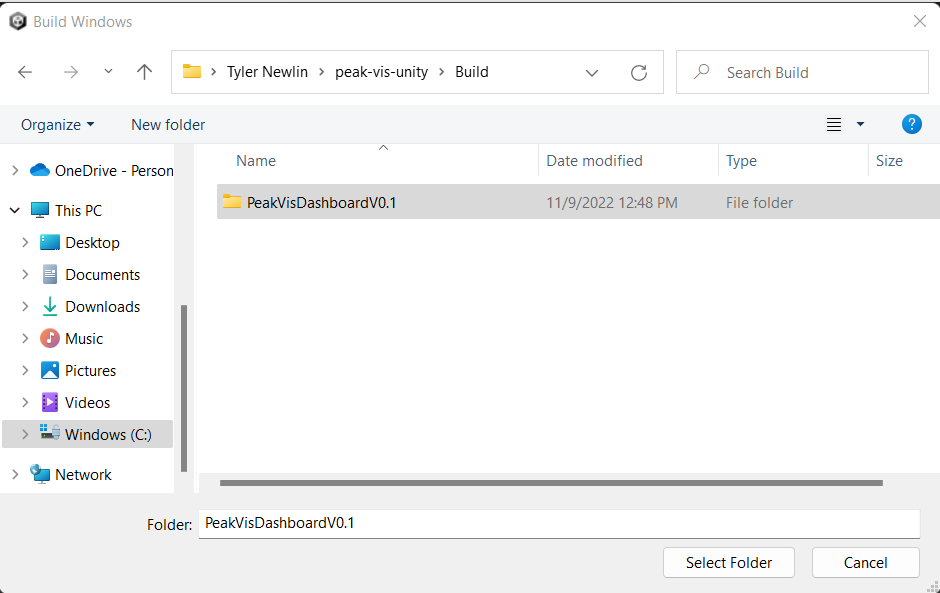
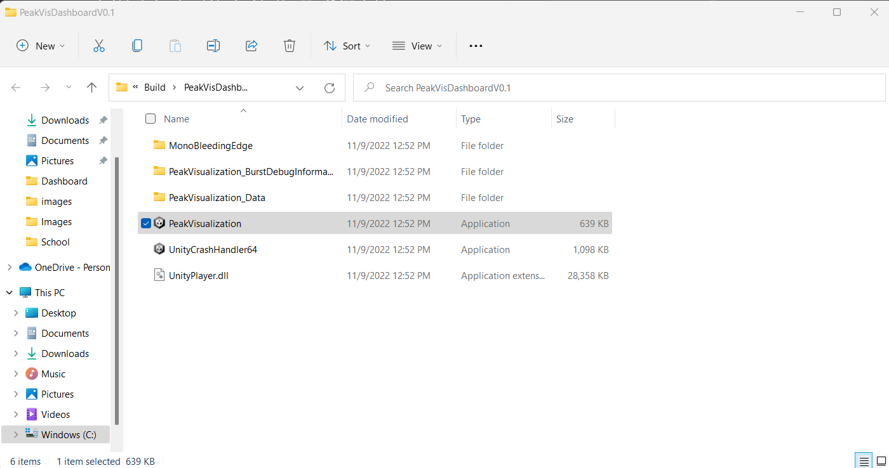
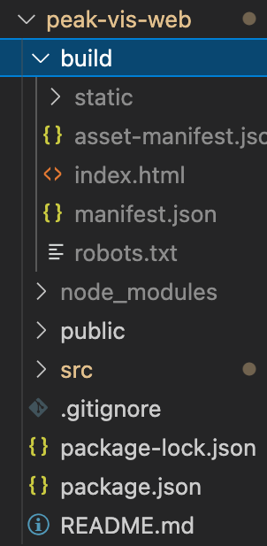

# Unity Application

1. From the Unity editor with the project open. Click **File** in the top left of the editor window then select **Build Settings...**
2. In the build setting window ensure that the the **PeakVisualizationDashboard** is the only scene selected in the `Scenes in build` table.

3. Press the build button. This is will open a prompt to choose where the build will be saved to. Go into the **Build** folder of the Unity project (this folder may not exist if you haven't run any builds before). While inside the **Build** folder create a new folder with whatever name you find most useful.

4. Once the build is finished It will open the folder that contains all of the build products. The **PeakVisualization** application will be the main executable for the application. 

# Web Application

- To build the web application, open terminal at the project directory.

- Then, run `npm run build` to create a build folder within the main directory.

- Upload the build folder to a hosting service.

