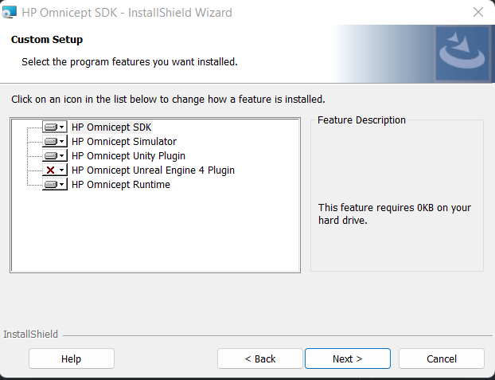

# Development


## Requirements for setup
---

- Our system requires [Unity](https://unity3d.com/get-unity/download) and the [HP Omnicept Developer SDK](https://developers.hp.com/omnicept/downloads). In order to download the HP Omnicept Developer SDK, first you must be a part of an organization with permission to access the SDK. You can create a organization within HP's developer portal [here](https://omnicept-console.hpbp.io/xr) once you do you can register an application as shown below.

- For Unity, any up-to-date operating system is compatible including Windows 7 SP1+, 8, 10, 64-bit versions only; Mac OS X 10.12+; Ubuntu 16.04, 18.04, and CentOS 7. 
HP Omnicept SDK is only compatible with Windows and requires a workaround for other operating systems. 

- Unity Editor Version 2021.3.11f1 is required to open the project. Unity allows for any IDE to be used for scripting in C#; Visual Studio is recommended for Mac.

## Downloading and setting up the SDK
---

- When on this [page](https://developers.hp.com/omnicept/downloads) click the button marked below to download the SDK


- Then go find the executable that was downloaded and run it


 - After going through the process of verification, the SDK can be accessed and the [documentation](https://developers.hp.com/omnicept/docs) can be followed for installation.

 - Go through the setup up wizard and accept the terms of service. When you get the point where it asks you what to install keep all options except for the Unreal Engine plugin

 

 - Then Finally click install

 ## Setting up the project locally
 ---

The project follows Unity’s default folder structure: Assets, Packages, and ProjectSettings. A .gitignore and README.md are included at the root for version control and presentation. Within the Assets folder are files and folders for the HP Omnisept SDK called Glia.

- To open this project locally, pull from this [repo](https://github.com/pfled/peak-vis-unity), open Unity Hub, then go to Open > Add project from disk. Then, select the folder of the cloned project.


- The HP SDK assets for Unity Should be in the project already so to add your credentials there will be a tab in the Unity editor labeled HP Omnicept click that then click configure and a new window will pop up where you can add you Client ID and Access key from this [page](https://omnicept-console.hpbp.io/xr/application)


]

- In order to run the project, click the play button at the top of the Unity Editor pane. While playing, the HP SDK will create a separate pop-up that can be used to simulate user input such as a change in eye gaze or heart rate.


- While you are running the application you can use the HP Omnicept Simulator that came with the SDK to send data to the application without needing a headset. The application can be found by searching in the Windows start menu. To actually begin to send information you need to hit "Send" or "Repeat" in the bottom left corner of the simulator


-In order to actually save data to an AWS bucket you will have to add the base URL of the ApiGateway API created by running CDK deploy as explain in the [Deployment Documentation](./Deployment.md). However, this is not required for any kind of unit testing or changes that need to be made for any other part of the project only if you need to actually test the upload.


- Running unit tests in Unity is done through the Unity Test Runner plugin. IMPORTANT - the HP provided prefab for the Omnicept SDK has caused frequent Unity crashes when running unit tests in `play mode` after the tests have ran, so it is recommended that you disable the HPGlia prefab in the scene before you run the unit tests.


## Setting up the web app locally
---

### Requirements

- This project can be viewed in any IDE; Visual Studio Code is recommended.

- Make you sure you have the correct version of [Docker Desktop](https://www.docker.com/products/docker-desktop/) installed.

- Python 3.11 or higher is required for the backend

- To open this project locally, pull from this [repo](https://github.com/pfled/peak-vis-webapp).

- If you don't have make you can run the command listed in the `Makefile` which is `coverage run -m pytest && coverage report -m`.
- If you want to run the unit tests without code coverage you can just run `pytest`.

### Running the project
- Open the project then open a terminal at the directory. You can run the project by running `docker compose up`. This will create a Docker container that has an image for a MySQL database, Backend, and Frontend When the container is running the output will look something like this.


- The Frontend will run on port 3000, the Backend will run on port 8080, and the MySQL database will run on port 3306.
  - To connect to the data do so through a socket connection with the username `peak-vis` and the password `dev`.

- You can stop the container by pressing `Control + C` in the terminal instance where the compose up command was ran. Or by stopping it in the Docker Desktop application.
  - If you are having issues with caching older versions of the code when restarting the Docker container after making changes you can run the command `docker compose up --build --force-reacreate`. This should rebuild the container and ignore all caches in Docker when the container starts.

### Frontend

The web app follows React folder structure standards. There is a public folder, a src folder containing components and assets, and files necessary for package management and git tracking. The components folder contains JavaScript files that create different components throughout the application. This is a feature of React that makes frontend code modular and repeatable. 

- To run unit tests use `npm run test` in the root directory of the project.

- You can view the fronte in your browser by connecting to http://localhost:3000.

### Backend

The api is built using Flask Python. To install all of the dependencies you can run `make install-dev` if you have and use `Make` or you could run the command in the make file: `pip install -r requirements/common.txt -r requirements/develop.txt` (you can replace `pip` with `pip3` if that is that Python package manager you prefer). 

The database can be initialized in the dev environment by running the commands `flask db migrate` then `flask db upgrade` which with use the `flask-migrate` package to automatically create the database schema defined by `Models` in the api code.

The file structure for the project is as follows:
```
backend
├── api
│   ├── __init__.py
│   ├── config.py
│   │
│   ├── controllers
│   │   
│   ├── models
│   │ 
│   ├── blueprints
│   │   
│   └── utils
│   
├── requirements
├── bin (used for running api in web server)
├── migrations (auto generated)
├── tests
├── wgsi.py (used for running api in web server)
└── setup.cfg (settings for flake8 linting)
```
 The `config.py` file contains the code for the main api and Flask settings and the `__init__.py` file in the `api` folder sets up the application. `controllers` is the folder that container the functional code for most of the api endpoints (routes). `utils` contains additional functional code for additional shared behaviour that don't belong in a single controller like checking if JWT tokens are blacklisted. `models` contain data classes that represent tables within the database it is also necessary to create database migrations. `blueprints` contain the files that define all of the endpoints (routes) in a blueprint which is a Flask construct. 

 To run the backend api completely you will need to add a `.env` file to the `backned` directory with these variables
 ```
DB_CONNECTION=
DB_USERNAME=peak-vis
DB_PASSWORD=dev
DB_HOST=127.0.0.1
DB_NAME=peak-visualization
SECRET_KEY=
S3_BUCKET_NAME=
AWS_ACCESS_KEY_ID=
AWS_SECRET_ACCESS_KEY=
 ``` 

The `S3_BUCKET_NAME`, `AWS_ACCESS_KEY_ID`, and `AWS_SECRET_ACCESS_KEY` should all be created and found on your AWS account. `DB_CONNECTION` is the database flavor that you will be using, currently we are using MySQL but you could use whatever other SQL flavor like `PostgreSQL`. Most of the `DB` variables are also set in the `docker-compose.yml` file when defining the database image.

## Linting
---

### Frontend
- The frontend is setup with ESLint/Prettier
- To run the code formatter i.e. Prettier type the command `npm format` in the root directory and this will run `prettier --write` on the entire project.
- There are two main commands for ESLint `npm lint` which will just run the basic ESLint command and `npm lint:fix` which will run some automatted fixes.

### Backend
- The Backend uses Flake8 for linting
- There are a couple ways to run the linter depending on preference
  - If you have `Make` can run the command `make lint` the Flake8 command
  - If you do not use `Make` you can just run the command in the file which is `flake8 api --count --show-source --statistics`
    - This will lint only the `api` folder becasue it contains the main code for the api. If you want strictly enforce the linting rules on the entire backend directory you can just run `flake8` in the backend directory.

### Unity Dashboard
- The Unity dashboard implements Stylecop for formatting rules and SonarLint for linting.
  - Both are implemented as NuGet packages that run in Visual Studio 2022.
  - Neither implement auto-fix with a single command, but errors will be caught as they are typed and VS will provide warnings.
  - Specific rules can be configured in the .editorconfig file.