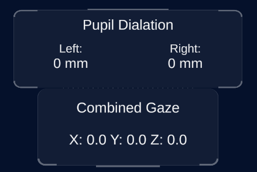

# Unity application

## Note for running the application the first time
---

By default users have to approve any application requesting data from the HP Omnicept for data collection. Normally a toat message will appear on Windows asking for approval, but if it doesn't or you have toat messages turned off you can open the **HP Omnicept Tray App** and approve the application as shown below.

## Features
---

The primary use for this application is to display the data being collected from the HP Omnicept sensors while using the headset.

### Eye tracking an pupilometry 

- On the side of the window there are two panels to display the data for the eye trackign and pupilometry sensors.
- The top window will display the pupil dialation of each eye in millimeters
- The bottom panel will display the combined gaze (roughly where a user is looking) in the form of a three-dimensional coordinate.

### Heart Rate

- In the center of the window is the smallest panel that displays the heart rate of the user (beats per minute).

### Cognitive load

 - On the right of window there is a panel that displays the cognitive load of a user in a range from 0.0 to 1.0.
 - Cognitive load is a scientific tearm for a measurement of mental effort required to perform a task. Here is a [link](https://www.youtube.com/watch?v=2Sk2_4U58yg) to a video from HP explaining cognitive load in more detail.

 

 ### Saving Data

 - On the bottom of the window there is a button labeled **Save Data** when you press that button it will save all of the data collected by the application to a JSON file.
 - When you press save the file path to where it was saved will be shown below the button. If you want to manipulate that file simple copy that file path and paste it into the search bar of the file explorer.
 - The file names are timestamps on when the file was saved.

<figcaption align="center">Usually the blurred text will be something like <b>Users\MyUserName\</b></figcaption>