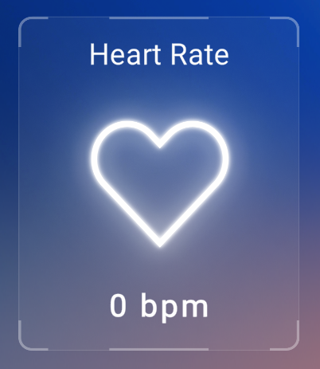

# Unity application

## Note for running the application the first time

---

By default users have to approve any application requesting data from the HP Omnicept for data collection. Normally a toat message will appear on Windows asking for approval, but if it doesn't or you have toat messages turned off you can open the **HP Omnicept Tray App** and approve the application as shown below.

## Features

---

The primary use for this application is to display the data being collected from the HP Omnicept sensors while using the headset.

### Eye tracking and pupilometry

- On the side of the window there are two panels to display the data for the eye tracking and pupilometry sensors.
- The top window will display the pupil dialation of each eye in millimeters and through a dot in that will change it's size depending on the user's dialation.
- The bottom panel will display the combined gaze (roughly where a user is looking) in the form of a three-dimensional coordinate.

### Heart Rate

- In the center of the window is the smallest panel that displays the heart rate of the user (beats per minute).
- The heart in the center will also pulse and change color depending on the user's heart rate.
- If the user's heart rate is less than 75 the heart will pulse slow with a light blue color. If between 76 and 135, the heart will pulse a bit faster with a yellow color. If between 136 and 175, the heart will beat faster and with a light red color. Finally, if the user's heart rate is above 176, the heart will pulse faster than before and with a dark red color.

### Cognitive load

- On the right of window there is a panel that displays the cognitive load of a user in a range from 0.0 to 1.0.
- The circle around the load number is a bar that will fill and change color depending on what the user's congitive load is.
- If the user's cognitive load is less than 0.40, the bar would fill to the load with a light blue color. If the load is between 0.41 and 0.66, the bar would fill to the load with a yellow color. If the user's load is between 0.67 and 0.75 the bar would fill with a light red color. Finally, if the user's cognitive load is greater than 0.76, the bar would fill to the load point with a dark red color.
- Cognitive load is a scientific tearm for a measurement of mental effort required to perform a task. Here is a [link](https://www.youtube.com/watch?v=2Sk2_4U58yg) to a video from HP explaining cognitive load in more detail.

### Saving Data

- On the bottom right of the window there is a textbox and button labeled **UserID** and **Save Data**. When The user enters their 6 digit UserId the **Save Data** button will then become interactable.
- When you press the button the user's data will then be uploaded to an AWS S3 bucket that stores the data by UserID and by timestamp of when uploaded.

# Web application

## Login

Users can access their datasets by entering the email and password they created during registration.

To get to registration click the link under the "LOGIN" button and create an account using your email on this page.

## Features

---

### Select Dataset

- The Simulation Results will appear on your dashboard. You can select which simulation's dataset to view.

### Chart Details

- You can see the value of specific points on the chart by hovering over them.

### Filter Charts

- You can filter which charts they want to view by clicking the pill toggles.

### Add Dataset Notes

- To add a note to a session dataset, click on any of the charts. A window will appear with the data and timestamp values automatically filled in, and more space to add a note.

### View Dataset Notes
- To view all saved notes for a given dataset, click "View Session Notes".

### Export PDF

- You can export the data to a PDF by clicking "Export PDF".

### Export Raw Data

- You can export the data to a JSON by clicking "Export Raw Data".

