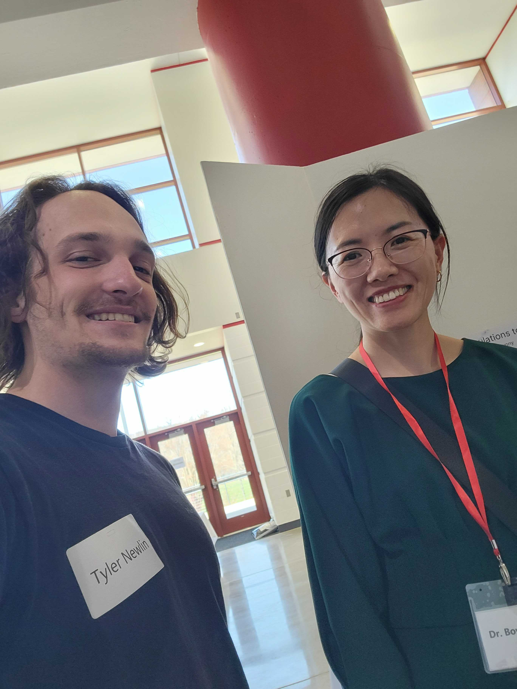
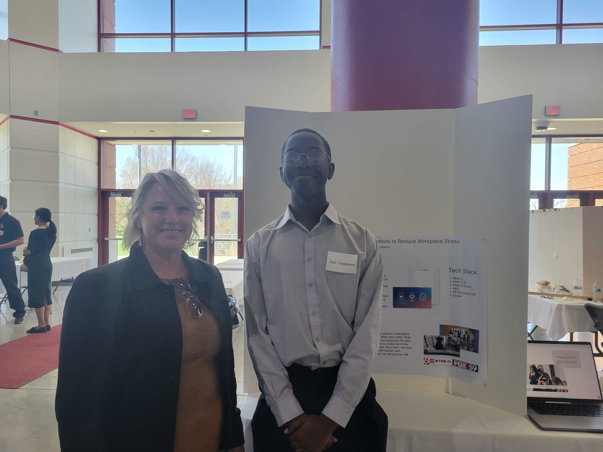
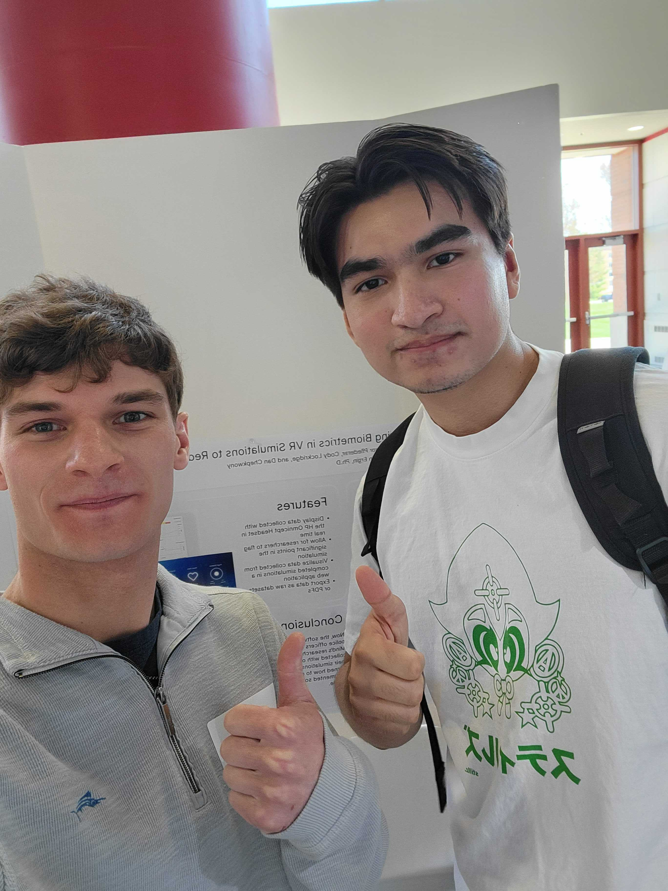
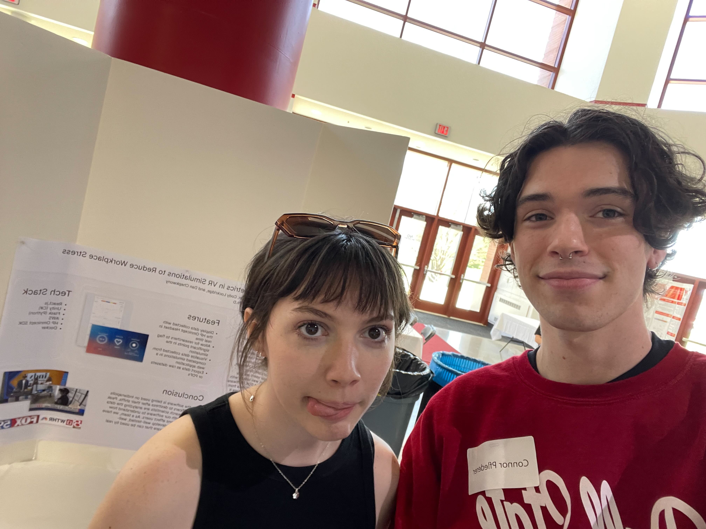
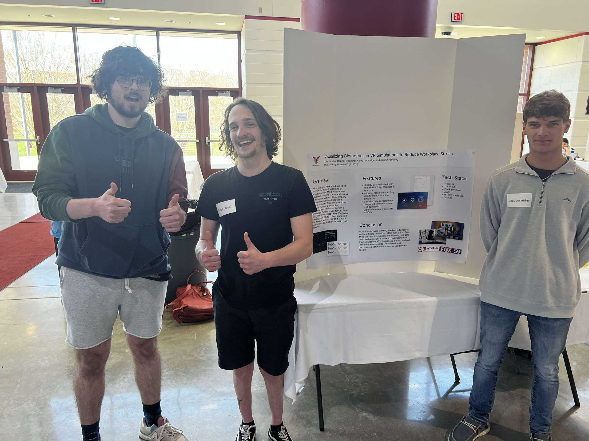
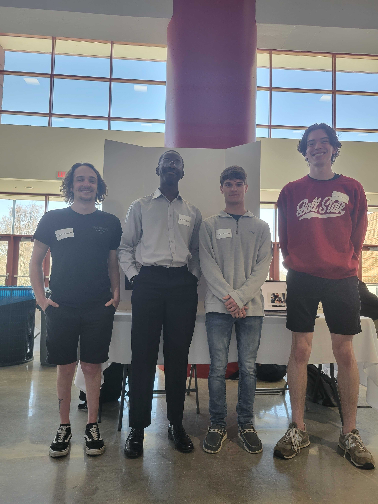

# People we presented to

### Dr. Bowen Zhang

### Natalie Yatess

### Julio Orozco

### Ketlin Holaday

### Drew Heiss

# Experience

## Tyler
---
Overall I enjoyed presenting at the student symposium. It felt like there was a lot of standing around however.
I wish there had been more people that came to talk to us during the time that we were there. I also enjoyed seeing some of the projects
from people in other disciplines around Ball State. I also wish that I had looked more at the schedule and made time for to attend
an oral presentation while I was there.

## Dan
---
I enjoyed the symposium. I felt proud explaining our project to people and seeing their impressions. I also liked seeing other people's posters and presentations.

## Cody
---
The student symposium was a fun experience. I enjoyed talking to people about the project and explaining different features of how it worked. The people that we talked to seemed to be very interested with our project. It was nice to see other projects from students with other studies than computer science. It was also neat to see all the other capstone projects for CS on display as well. Overall, I think that the student symposium was a fun experience.

## Connor
---
The student symposium ended up being a more satisfying and fun experience than I expected. I was a bit nervous going into it, but it turned out to be a pretty laid back environment where everyone just got to show off their hard work. I enjoyed presenting our project to people, as many seemed genuinely interested in what we had been up to. Also, since we stopped doing in-class presentations, I really had no idea where the other capstone groups were at, and it was nice to catch up with them and see how their progress compared to our own.

